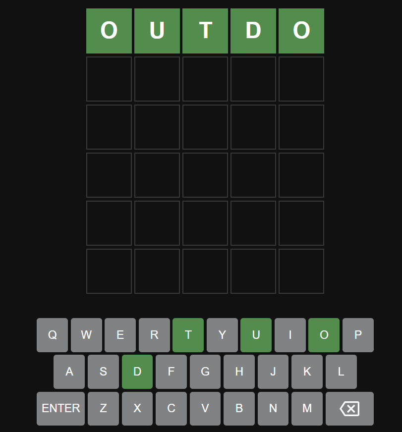

# Wordle Game

Welcome to the **Wordle Game**! This README file provides all the necessary information to get started with the game, understand its rules, and explore its features. Let's dive in!

## Table of Contents
- [Introduction](#introduction)
- [Game Rules](#game-rules)
- [Instructions](#instructions)
- [Color Codes of Letters](#color-codes-of-letters)
- [Game Preview](#game-preview)
- [Installation](#installation)
- [How to Play](#how-to-play)
- [Features](#features)
- [Contributing](#contributing)
- [License](#license)

## Introduction

**Wordle Game** is a fun and engaging word puzzle game inspired by the popular Wordle game. The objective is to guess a hidden 5-letter word within 6 attempts. The game provides feedback on each guess, helping you inch closer to the correct word with each try.

## Game Rules

1. You have 6 attempts to guess the correct 5-letter word.
2. Each guess must be a valid 5-letter word.
3. After each guess, the color of the letters will change to show how close your guess was to the word:
   - Green: Correct letter in the correct position.
   - Yellow: Correct letter in the wrong position.
   - Gray: Incorrect letter.

## Instructions

1. Enter a 5-letter word as your guess.
2. Press the "Enter" key to submit your guess.
3. Observe the color-coded feedback for your guess:
   - Green letters are in the correct position.
   - Yellow letters are correct but in the wrong position.
   - Gray letters are incorrect.

## Color Codes of Letters

- **Green**: The letter is in the correct position.
- **Yellow**: The letter is correct but in the wrong position.
- **Gray**: The letter is incorrect.

## Game Preview



## Installation

To play the Wordle   Game locally, follow these steps:

1. **  the Repository**:
   ```bash
   git   https://github.com/yourusername/wordle- .git


   


   
